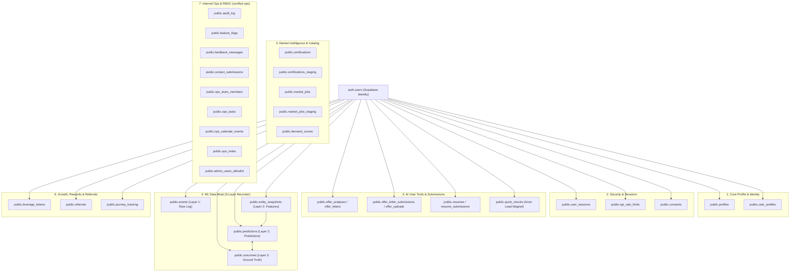
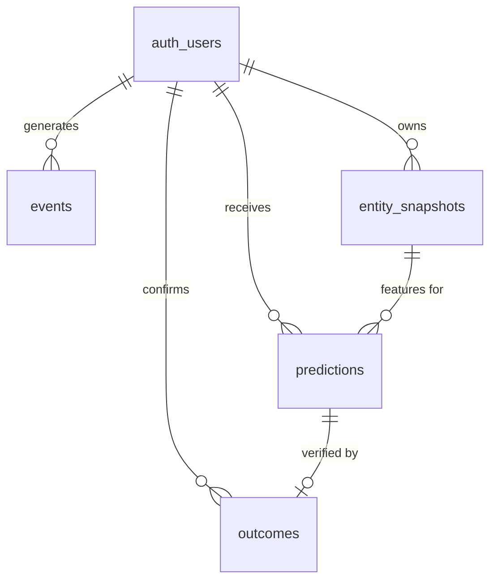

# Certifyd & Certifyd-Ops: Master Database Schema Reference

This document catalogs every Postgres/Supabase table across the **Certifyd** web application (`certifyroi`) and the **Certifyd-Ops** admin operations suite (`certifyd-ops`).

---

## Architecture Overview & Subsystems

The database consists of **32 tables** organized into **7 interconnected subsystems**:

---

## 1. Core Profile & Identity Layer

All user data cascades automatically (`ON DELETE CASCADE`) from `auth.users(id)` so user deletion removes all personal data.

### `public.profiles`
* **Purpose**: Primary public profile record created upon user registration.
* **Primary Key**: `id UUID REFERENCES auth.users(id) ON DELETE CASCADE`
* **Key Columns**:
  * `display_name TEXT`, `avatar_url TEXT`, `created_at TIMESTAMPTZ`
* **RLS**: Owner-only (`auth.uid() = id`).

### `public.user_profiles`
* **Purpose**: Rich domain & ROI profile storing career context and DPDP consent flags.
* **Primary Key**: `id UUID DEFAULT gen_random_uuid()`
* **Foreign Key**: `user_id UUID REFERENCES auth.users(id) ON DELETE CASCADE`
* **Key Columns**:
  * `current_salary_lakhs NUMERIC`, `target_role TEXT`, `experience_band TEXT`, `city TEXT`
  * `consent_given BOOLEAN`, `consent_timestamp TIMESTAMPTZ`, `consent_version VARCHAR(20)`
  * `market_pulse_early_access BOOLEAN DEFAULT false`

---

## 2. Security, Session Control & Audit Hardening Layer

### `public.user_sessions`
* **Purpose**: Tracks active login sessions and enforces a maximum of **5 concurrent sessions** per user.
* **Primary Key**: `id UUID DEFAULT gen_random_uuid()`
* **Foreign Key**: `user_id UUID REFERENCES auth.users(id) ON DELETE CASCADE`
* **Key Columns**:
  * `session_token_hash TEXT UNIQUE NOT NULL`, `last_active TIMESTAMPTZ`, `ip_address INET`, `is_revoked BOOLEAN`
* **Trigger**: `trg_enforce_max_sessions` runs `enforce_max_concurrent_sessions()` on insert.

### `public.api_rate_limits`
* **Purpose**: Atomic ledger for IP/user rate throttling to prevent burst scraping.
* **Primary Key**: `id UUID DEFAULT gen_random_uuid()`
* **Foreign Key**: `user_id UUID REFERENCES auth.users(id) ON DELETE CASCADE`
* **Key Columns**:
  * `action_type VARCHAR`, `ip VARCHAR`, `created_at TIMESTAMPTZ`
* **Stored Procedure**: `check_and_increment_rate_limit(p_user_id, p_action, p_ip, p_max)`

### `public.consents`
* **Purpose**: DPDP Act 2023 compliance ledger recording explicit versioned user opt-ins.
* **Primary Key**: `id UUID DEFAULT gen_random_uuid()`
* **Foreign Key**: `user_id UUID REFERENCES auth.users(id) ON DELETE CASCADE`
* **Key Columns**:
  * `consent_type TEXT` (`ml_training`, `marketing`, etc.), `consent_text_version TEXT`, `granted_at TIMESTAMPTZ`, `ip_hash TEXT`

---

## 3. AI User Tools & Analysis Submissions Layer

### `public.offer_analyses` & `public.offer_letters`
* **Purpose**: Records user offer letter analyses, CTC breakdowns, and negotiation outputs.
* **Foreign Key**: `user_id UUID REFERENCES auth.users(id) ON DELETE CASCADE`
* **Key Columns**:
  * `city TEXT`, `target_job_title TEXT`, `ctc_breakdown JSONB`, `negotiation_script TEXT`, `status TEXT`

### `public.offer_letter_submissions` & `public.offer_uploads`
* **Purpose**: Manages verifiable offer letter uploads with synchronous PII extraction and auto-deletion (`cleanup_expired_offer_uploads()`).
* **Foreign Key**: `user_id UUID REFERENCES auth.users(id) ON DELETE SET NULL`
* **Key Columns**:
  * `status TEXT` (`processing`, `processed`, `deleted`), `deleted_at TIMESTAMPTZ`, `extracted_data JSONB` (`headline_ctc`, `notice_period_days`)

### `public.resumes` & `public.resume_submissions`
* **Purpose**: Stores resume scanner uploads, parsed skills, and anomaly/PII verification scores.
* **Foreign Key**: `user_id UUID REFERENCES auth.users(id) ON DELETE CASCADE`
* **Key Columns**:
  * `file_url TEXT`, `parsed_data JSONB`, `certs_found JSONB`, `anomaly_score INTEGER`, `pii_scan JSONB`, `status TEXT`

### `public.quick_checks`
* **Purpose**: Lead-magnet anonymous quick salary checks from the homepage/onboarding flow.
* **Primary Key**: `id UUID DEFAULT gen_random_uuid()`
* **Key Columns**:
  * `base NUMERIC`, `variable NUMERIC`, `city TEXT`, `role TEXT`, `percentile_result INTEGER`, `ip_hash TEXT`

---

## 4. ML Data Moat (3-Layer Black Box Recorder)

This is the system designed to capture structured training data without storing raw PII.

### Layer 1: `public.events`
* **Purpose**: Append-only behavioral ledger (what tools users ran, what certification pairs they compared).
* **Foreign Key**: `user_id UUID REFERENCES auth.users(id) ON DELETE SET NULL`
* **Key Columns**:
  * `session_id TEXT`, `event_type TEXT`, `tool_name TEXT`, `entity_type TEXT`, `properties JSONB`, `consent_ml_training BOOLEAN`

### Layer 2: `public.entity_snapshots`
* **Purpose**: Versioned structured input features (deduplicated via `data_hash SHA-256`, never raw PII or PDFs).
* **Foreign Key**: `user_id UUID REFERENCES auth.users(id) ON DELETE SET NULL`
* **Key Columns**:
  * `entity_type TEXT` (`roi_profile`, `offer_feature_vector`), `schema_version TEXT`, `structured_data JSONB`, `data_hash TEXT`, `model_used TEXT`

### Layer 2: `public.predictions`
* **Purpose**: Records exact predictions emitted by our tools linked to the snapshot features.
* **Foreign Keys**:
  * `user_id UUID REFERENCES auth.users(id)`
  * `snapshot_id UUID REFERENCES public.entity_snapshots(id) ON DELETE CASCADE`
  * `outcome_id UUID REFERENCES public.outcomes(id) ON DELETE SET NULL`
* **Key Columns**:
  * `tool_name TEXT`, `prediction JSONB` (`predicted_hike_pct`, `break_even_months`), `model_version TEXT`

### Layer 3: `public.outcomes`
* **Purpose**: Ground truth confirmation of actual salary hikes 6-12 months later (the data moat).
* **Foreign Keys**:
  * `user_id UUID REFERENCES auth.users(id)`
  * `prediction_id UUID REFERENCES public.predictions(id) ON DELETE SET NULL`
* **Key Columns**:
  * `actual_outcome JSONB` (`actual_salary_hike_pct`, `completed_cert`), `verification_method TEXT` (`self_reported` | `offer_upload`), `confidence_weight NUMERIC`
* **Stored Function**: `record_outcome_and_link_prediction(...)` automatically links `predictions.outcome_id` to `outcomes.id`.

---

## 5. Market Intelligence & Certification Master Catalog

### `public.certifications` & `public.certifications_staging`
* **Purpose**: Master catalog of certifications, pricing, and average market hikes. Staging allows editorial review before pushing live.
* **Key Columns**:
  * `cert_name TEXT NOT NULL`, `vendor TEXT`, `exam_fee INTEGER`, `prep_cost INTEGER`, `study_hours INTEGER`, `validity TEXT`, `diff_count INTEGER`

### `public.market_jobs` & `public.market_jobs_staging`
* **Purpose**: Real-time city-wise open job listings and demand heat factors.
* **Key Columns**:
  * `cert_name TEXT`, `city TEXT`, `open_roles INTEGER`, `yoy_change INTEGER`, `heat_factor TEXT`, `sources_count JSONB`, `data_quality INTEGER`

### `public.demand_scores`
* **Purpose**: Computed certification demand index per user role.
* **Foreign Key**: `user_id UUID REFERENCES auth.users(id) ON DELETE CASCADE`

---

## 6. Loyalty, Growth & Referrals Layer

### `public.leverage_tokens`
* **Purpose**: Lightweight token ledger rewarding users for completing profiles and logging verified data.
* **Foreign Key**: `user_id UUID REFERENCES auth.users(id) ON DELETE CASCADE`
* **Key Columns**:
  * `amount INTEGER`, `reason TEXT` (`profile_complete`, `roi_calc_run`, `referral_converted`), `created_at TIMESTAMPTZ`

### `public.referrals`
* **Purpose**: Double-sided referral tracking.
* **Foreign Keys**:
  * `referrer_id UUID REFERENCES auth.users(id)`
  * `referee_id UUID REFERENCES auth.users(id)`
* **Key Columns**:
  * `referral_code TEXT UNIQUE`, `status TEXT` (`pending`, `signed_up`, `converted`)

### `public.journey_tracking`
* **Purpose**: Onboarding funnel step completion tracking.
* **Foreign Key**: `user_id UUID REFERENCES auth.users(id) ON DELETE CASCADE`

---

## 7. Internal Operations, RBAC & Audit (`certifyd-ops`)

### `public.audit_log`
* **Purpose**: Append-only tamper-resistant ledger of all admin actions in `certifyd-ops`.
* **RLS**: Insert-only (`FOR INSERT WITH CHECK (true)`). No update or delete policies.
* **Key Columns**:
  * `admin_email TEXT`, `admin_role TEXT`, `action_type TEXT`, `target_table TEXT`, `old_value JSONB`, `new_value JSONB`

### `public.feature_flags`
* **Purpose**: Dynamic system-wide feature flags (`roi_calculator`, `offer_letter_analyzer`, etc.).
* **Primary Key**: `flag_key TEXT / flag_name TEXT PRIMARY KEY`
* **Key Columns**: `enabled BOOLEAN / is_enabled BOOLEAN`, `description TEXT`

### `public.feedback_messages` & `public.contact_submissions`
* **Purpose**: Customer feedback and enterprise/college placement contact inquiries.
* **Key Columns**: `tool_used TEXT`, `rating INTEGER`, `full_feedback TEXT`, `status TEXT`, `assigned_to TEXT`

### Internal Ops Workflow Tables (`supabase_ops_tables.sql`)
* **`public.ops_team_members`**: Operations team directory and detailed RBAC JSONB (`permissions: { access_marketing, access_technical, access_database }`).
* **`public.ops_tasks`**: Internal Kanban task tracker (`title`, `section`, `assignee`, `priority`, `status`, `checklist JSONB`).
* **`public.ops_calendar_events`**: Ops calendar items (`title`, `date`, `time`, `section`).
* **`public.ops_notes`**: Internal documentation & discussion threads (`title`, `content`, `section`, `comments JSONB`).
* **`public.admin_users_allowlist`**: Super admin email whitelist (`email PRIMARY KEY`, `role`).
